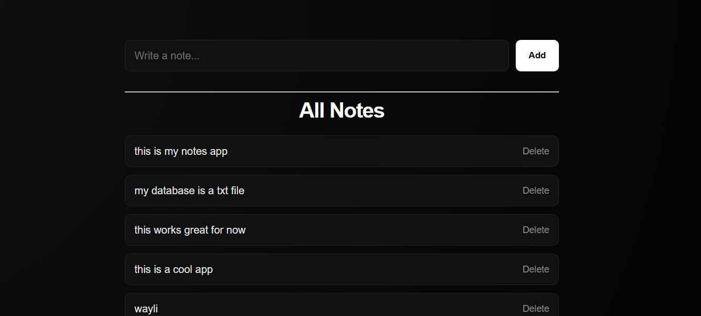

# PHP Notes App

A simple note-taking web app built with PHP. Users can add and delete notes stored in `notes.txt`.\
**Live Demo:** 

## Files

- `index.php` — main page for viewing, adding, and deleting notes
- `save.php` — handles note submission and appends notes to `notes.txt`
- `helpers.php` — utility helper functions
- `notes.txt` — stores all notes
- `style.css` — basic styling
- `attachements/image.png` — preview image shown in this README

## Usage

1. Place the project in a PHP-enabled web server root.
2. Open `index.php` in a browser.
3. Add a note using the form.
4. Delete notes with the provided delete links.

## Notes

- Notes are stored as plain text in `notes.txt`.
- This app is intended as a simple demo and does not include authentication.
